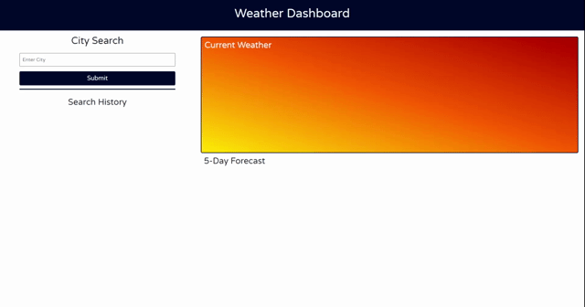

# Weather Dashboard

## Objective

The weather dashboard allows the user to search a city.  That city's current weather and five day forecast is displayed on the right side of the screen.  The last eaight searched cities are saved on the left as buttons.  When the button is clicked, that city's weather is diplayed again on the right.  

## User Story

```
AS A traveler
I WANT to see the weather outlook for multiple cities
SO THAT I can plan a trip accordingly
```

## Acceptance Criteria

```
GIVEN a weather dashboard with form inputs
WHEN I search for a city
THEN I am presented with current and future conditions for that city and that city is added to the search history
WHEN I view current weather conditions for that city
THEN I am presented with the city name, the date, an icon representation of weather conditions, the temperature, the humidity, the wind speed, and the UV index
WHEN I view the UV index
THEN I am presented with a color that indicates whether the conditions are favorable, moderate, or severe
WHEN I view future weather conditions for that city
THEN I am presented with a 5-day forecast that displays the date, an icon representation of weather conditions, the temperature, the wind speed, and the humidity
WHEN I click on a city in the search history
THEN I am again presented with current and future conditions for that city
```

## Final Product
[Weather Dashboard](https://cpaschall.github.io/weather-dashboard)

## Mock-Up

The following image shows the web application's appearance and functionality:
